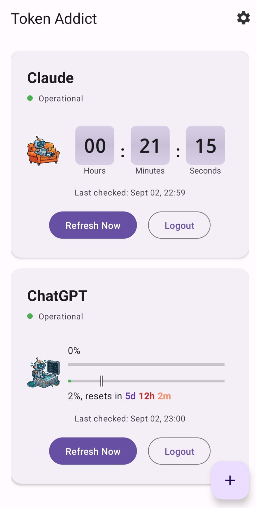

# Token Addict

Monitors AI usage limits for Claude.ai, Kimi Code, and ChatGPT. Displays real-time utilization, reset countdowns, and sends notifications when limits are approaching or have been reached.

<p align="center">
  
</p>

## Prerequisites

- JDK 21
- Android SDK

## Build

```bash
./gradlew assembleDebug
```

## Test

```bash
./gradlew test
```

## Architecture

Token Addict follows an MVVM architecture with manual dependency injection:

- **`data/` layer**: Network calls via OkHttp, session/cookie management, encrypted storage via `EncryptedSharedPreferences`, and OAuth flows for Kimi. Each provider implements `AiProvider` and is registered in `ProviderRegistry`.
- **`ui/` layer**: Activities + ViewModels with LiveData and sealed `UiState` classes
- **`worker/` layer**: WorkManager-based periodic usage checks and service-status polling for each provider
- **`receiver/` layer**: Boot and reset-alarm broadcast receivers
- **`security/` layer**: Root/emulator/debug detection at startup, network security config with certificate pinning

The app monitors three AI providers:
- **Claude.ai**: Session-based authentication via WebView login + cookie persistence
- **Kimi Code**: OAuth 2.0 Device Code flow with token refresh
- **ChatGPT**: Session-based authentication via WebView login + token persistence

Service-status monitoring polls provider status pages every 30 minutes (configurable) and triggers fast-polling on outages.

## Permissions

| Permission | Purpose |
|---|---|
| `INTERNET` | API calls to Claude.ai, Kimi Code, and ChatGPT |
| `SCHEDULE_EXACT_ALARM` | Exact reset countdown notifications |
| `POST_NOTIFICATIONS` | Usage limit warnings and re-login alerts (Android 13+) |
| `RECEIVE_BOOT_COMPLETED` | Re-schedule periodic checks after device restart |
| `FOREGROUND_SERVICE` | Background usage polling |
| `REQUEST_IGNORE_BATTERY_OPTIMIZATIONS` | Reliable background execution |

## Release Process

1. Update `versionCode` and `versionName` in `app/build.gradle.kts`
2. Build the release APK:
   ```bash
   ./gradlew assembleRelease
   ```
3. The signed APK is at `app/build/outputs/apk/release/app-release.apk`
4. Distribute via sideloading or your preferred channel
